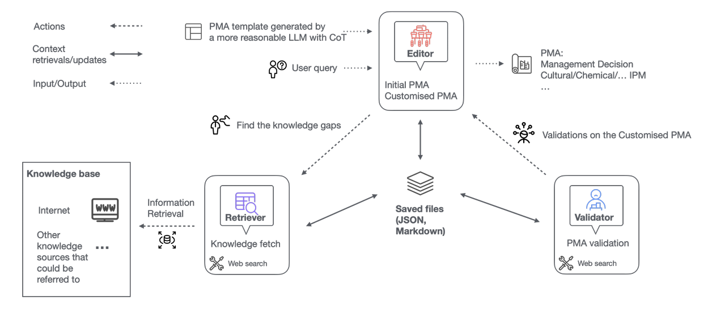

# AgriPest Agent

Welcome to **AgriPest Agent** — a multi-agent AI example built on top of **crewAI** for generating evidence‑based, localised pest management advice (PMA). This repository demonstrates a three-agent editorial workflow (Editor, Retriever, Validator) that synthesizes, supplements, and validates pest-management recommendations using LLMs and trustworthy external sources.

## Quick Summary 

We have built a multi-agent system that generates reliable and evidence‑based pest management advice (PMA). Our system design consists of three specialized agents:

- **Editor** — synthesizes pest management recommendations into a structured PMA and produces an initial, coherent advisory.
- **Retriever** — identifies knowledge gaps in the initial PMA and gathers relevant external data to bridge those gaps.
- **Validator** — acts as a manager that supervises the Retriever and Editor, cross-validates claims, verifies thresholds and decisions, and corrects errors or inconsistencies.

We integrate knowledge from trusted sources (primarily government IPM guidance, FAO/UN reports, and targeted web searches). Through structured prompts, templates, and a validation stage, the system yields more accurate, reliable, and actionable pest management advice.


## Why an editorial multi-agent workflow?

The editorial paradigm separates responsibilities and reduces single-agent hallucination risks by:
- letting a **Retriever** collect and summarize external evidence,
- letting an **Editor** focus on synthesis and clear communication, and
- letting a **Validator** enforce checks and objective thresholds (e.g., treatment thresholds, pesticide guidelines).


## Workflow diagram



**Workflow description:** The user provides a scenario and the **Editor** creates an initial PMA (guided by a reasoning template). The **Retriever** finds missing facts (thresholds, local conditions, resistance data) and returns curated evidence. The **Editor** integrates the evidence and produces a customized PMA. The **Validator** reviews the customized PMA, cross-checks thresholds and sources, and corrects or confirms the final PMA. The final response is saved as a Markdown file (`validated_pma.md`).


## Installation

Requires Python 3.10–3.13.

```bash
python -m venv .venv
# Windows
.venv\Scripts\activate
# macOS / Linux
source .venv/bin/activate
pip install -r requirements.txt
pip install uv  # if not installed
```

Optional: use `crewai install` to lock and install dependencies via crewAI.

Add your API keys to an `.env` in the project root (example):
```
GEMINI_API_KEY=...
SERPER_API_KEY=...
```

## Running the Demo

1. Edit the input example in `agri_project/main.py` to set `crop_name`, `pest`, `infestation_severity`, `location`, etc.
2. From the `agri_project` folder run:
```bash
crewai run
```
The crew will run the configured agents and produce a `validated_pma.md` in the repository root (or in the configured output folder).

---

## Files & Outputs

- `validated_pma.md` — final PMA produced after Validator confirms or corrects the PMA.
- `config/agents.yaml` & `config/tasks.yaml` — agent profiles and their tasks (use to customise roles or introduce new agents).


## Contributing & Customisation ideas

- Add domain-specific retrieval connectors (e.g., direct country-level IPM PDFs, FAO country pages, local extension APIs).
<!-- - Replace or augment the web search tool with a vector DB + RAG pipeline to improve retrieval relevance for offline or proprietary corpora.
- Add an “auditor” agent that logs decisions and produces a short, verifiable audit trail for each PMA (e.g., list of external sources and the specific facts they supported).
- Integrate local farmer inputs and imagery (with appropriate privacy safeguards) to improve diagnostics over time. -->

## Checkout a small working demo below
<div style="position: relative; padding-bottom: 56.25%; height: 0;"><iframe src="https://www.loom.com/embed/19014837a2514a67b913e9d02604cf53?sid=f2aa2844-3e45-426d-89bd-f0991bc26629" frameborder="0" webkitallowfullscreen mozallowfullscreen allowfullscreen style="position: absolute; top: 0; left: 0; width: 100%; height: 100%;"></iframe></div>

## Support & links

- crewAI docs: https://docs.crewai.com
- crewAI repo: https://github.com/joaomdmoura/crewai
- Project’s original README (for reference). fileciteturn0file1
